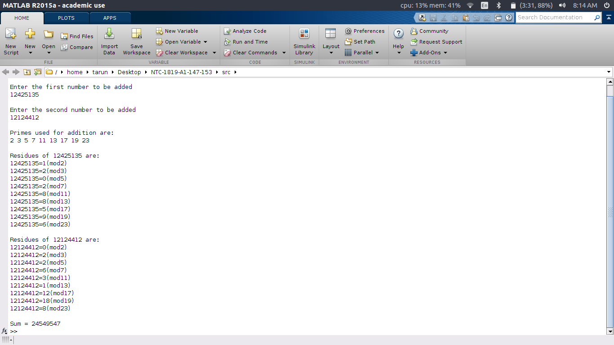
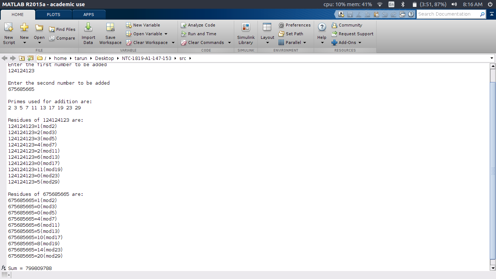
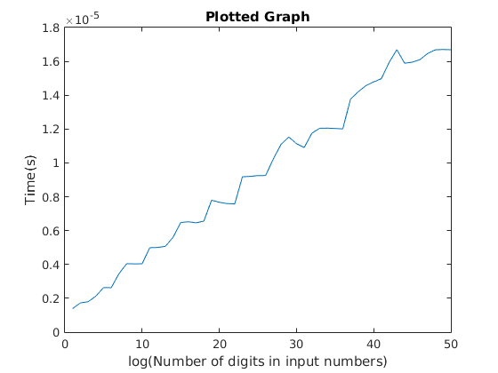

## Adding Two Large Numbers using Chinese Remainder Theorem

### Problem Statement
Write a MATLAB code to add large integers exceeding the word size of the computer using the Chinese remainder theorem.

### Members
Tarun Anand - 16CO147
Archit Pandey - 16CO153

### Tools used
1. Matlab

### The Chinese Remainder Theorem
[Reference](https://crypto.stanford.edu/pbc/notes/numbertheory/crt.html)

Suppose we wish to solve the equations:  
```math
	x=a(modp) ... (i)
	x=b(modq) ... (ii)
```
where p and q are co-prime.
The Chinese Remainder Theorem states that there exists a unique solution for x (mod pq).

Let p1=p<sup>-1</sup>(modq) and q1=<sup>q−1</sup>(modp). These must exist since *p*,*q* are coprime. Then if *y* is an integer such that $`y=aqq_1+bpp_1 (modpq)`$ then *y* satisfies both equations (i) and (ii).

To find y, using Euclid's Extended Algorithm:
1. Find m and n such that $`pm+qn=1`$.
2. y is given by $`y=pmb+qna`$

### Euclid's Extended Algorithm:

For any 2 integers *a* and *b* Euclid's Extended Algorithm helps us find 2 integers *x* and *y* such that  
```math
	ax + by = gcd(a,b)
```
The following steps help us determine *x* and *y*  
```math
	if b = 0
		then the gcd(a,b) = a and x=1,y=0
	else
		r = a mod b
		Recursively use the algorithm to obtain x' and y' where bx' + ry' = gcd(b,r)
		x = y'
		y = x' - floor(a,b)*y'
		gcd(a,b) = gcd(b,r)

```
The calculated values *x* and *y* are utilized in the Chinese Remainder Theorem.

### Directory Structure
1. src/main.m - main function
2. src/crt.m - module containing code for Chinese Remainder Theorem
3. src/euclid.m - module containing code for Extended Euclid's Algorithm
4. src/genPrimes.m - module containing code that generates primes to be utilized for CRT.
5. src/addusingCRT.m - module containing code that adds two numbers using CRT.
6. src/plotter.m - module containing code that helps in plotting the time taken to obtain results.
7. src/printArrayWithMessage.m - module containing code for formatted printing.
8. src/unused/ - folder that contains various modules which were written but finally not implemented.
9. img/ - folder that contains the various screenshots and graphs.


### Screenshots




### Graph


